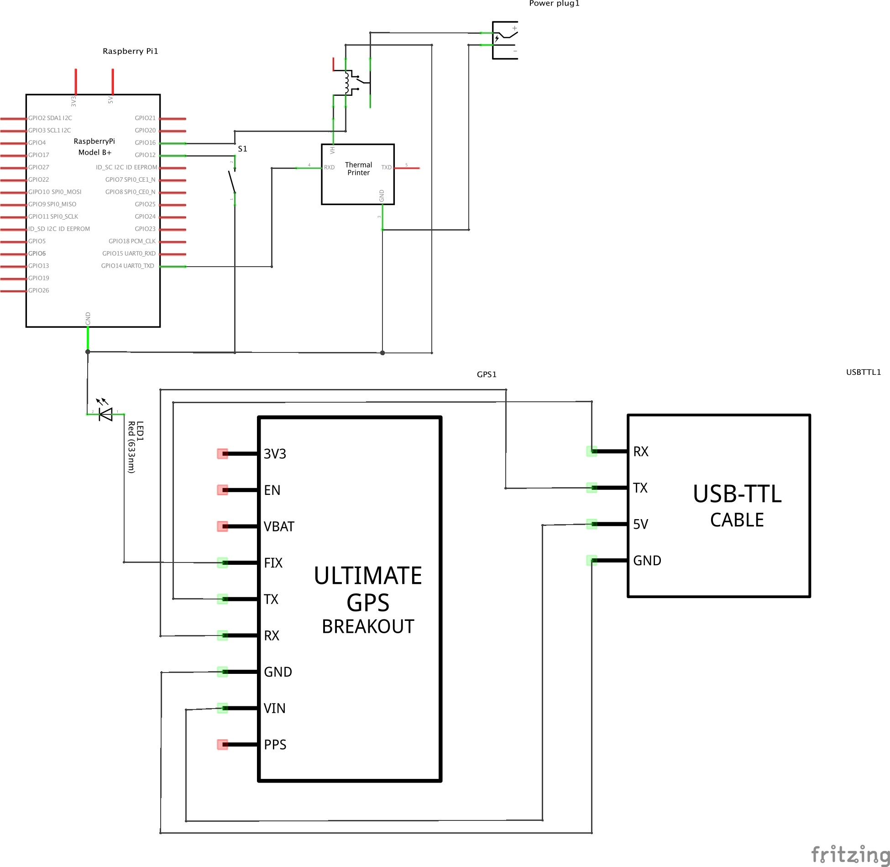

Big Green Button
===

####Introduction
This is a collaboration between Bristol Green Captial, Chloe Meineck and David Haylock.
The project is split into two parts:

######The Collection
This is the python scripts which gathers pledge location, time and generates unique logins for users printed via thermal printer.

######The Display
This is where the pledges are collected and displayed on a map. Users are then able to access their pledge change the title, what they are going to pledge and if the gps is out alter the coordinates.

####Components

* [Raspberry Pi B+](https://www.coolcomponents.co.uk/raspberry-pi-model-b.html)
* [Adafruit Ultimate GPS Unit] (http://www.adafruit.com/products/746)
* [Standard LCD 16x2] (http://www.adafruit.com/products/181?&main_page=product_info&products_id=181)
* [Mini Thermal Receipt Printer] (https://www.adafruit.com/products/597)

####Dependancies
The code has the following dependancies:

#####Web
* [Bootstrap](http://getbootstrap.com/javascript/)
* [Open Street Maps API](http://wiki.openstreetmap.org/wiki/API_v0.6)
* [Leaflet.js](http://leafletjs.com/)

#####Python
* [Adafruit Thermal Printer](https://github.com/adafruit/Python-Thermal-Printer)

####How to install
Install the following Dependancies
```
$ sudo apt-get install pip
$ sudo apt-get install python-pip
$ sudo pip install RPi.GPIO
$ sudo apt-get install build-essential requests python-dev python-smbus gpsd gpsd-clients python-gps python-serial python-imaging python-unidecode
$ sudo apt-get update
```

Clone this Repo
```git clone https://github.com/DHaylock/BigGreenButton.git```

####Wiring



#####Starting Script
You will need to insert this code into the /etc/rc.local file so when the Pi boots it will launch the python script.
```
#!/bin/sh -e
#
# rc.local
#
# This script is executed at the end of each multiuser runlevel.
# Make sure that the script will "exit 0" on success or any other
# value on error.
#
# In order to enable or disable this script just change the execution
# bits.
#
# By default this script does nothing.

# Print the IP address
_IP=$(hostname -I) || true
if [ "$_IP" ]; then
  printf "My IP address is %s\n" "$_IP"
fi

./startBigGreenButton.sh &

exit 0
```
